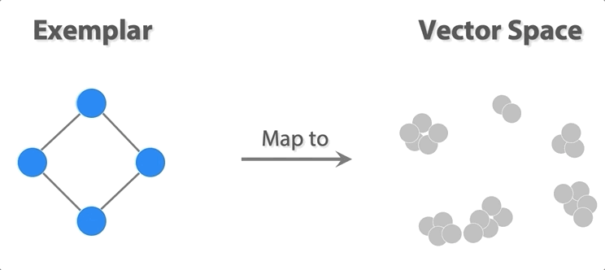
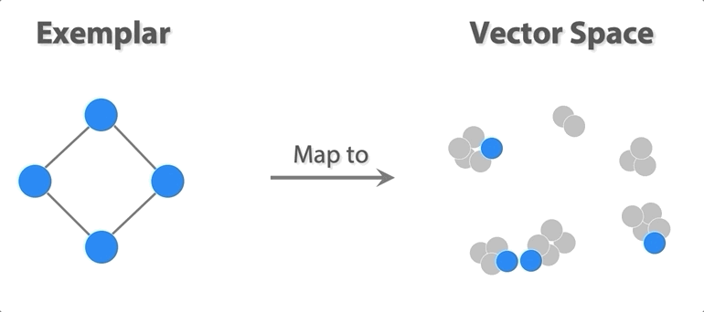
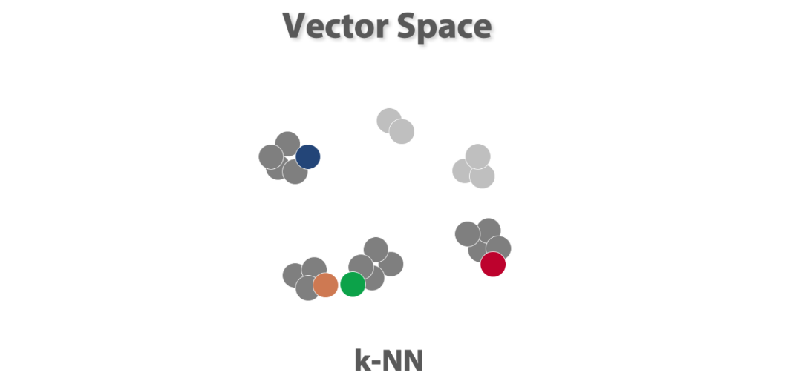
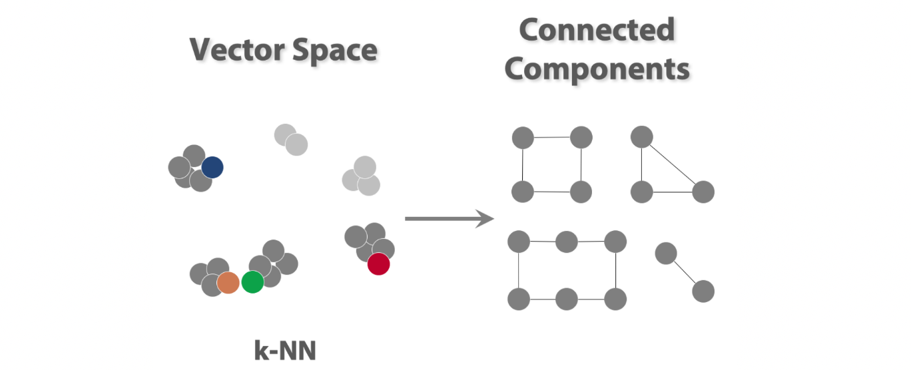
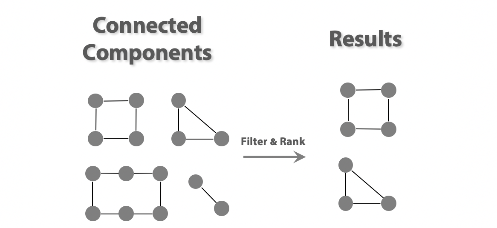
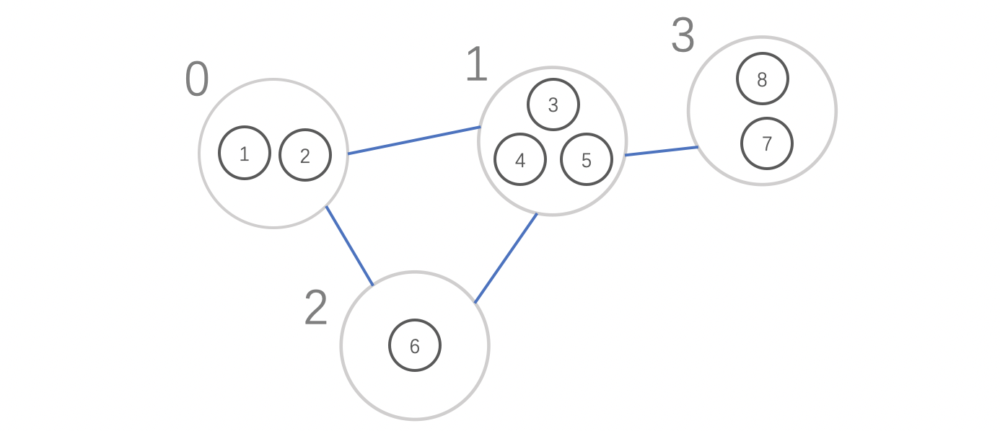

# S3: Similar Structure Search algorithm based on graph embedding

## Introduction

It's quite a big challenge to find similar structures of a given substructure in a large scale network. To achieve this goal, we developed **S3** , a similar substructure search algorithm in the paper: [Structure-Based Suggestive Exploration: A New Approach for Effective Exploration of Large Networks](https://ieeexplore.ieee.org/abstract/document/8440813). Based on graph embedding aproaches, when given a substructure in a large network, we can easily find similar structures by S3.

## Requirements

Some Python libraries:

- sklearn
- numpy
- scipy
- networkx

## Approach Details

#### Step 1: get vectors for  exemplar

Map the given exemplar into vector space(embedding space, should be calculated in advance), it means that we can get a vector for each exemplar node from the graph embedding result. 



#### Step 2: compute compound graph(cluster)

Perform clustering algorithm(DBScan) to cluster the exemplar nodes into a compound graph. Since the exemplar nodes might be similar to each other, this step will improve the precision of the whole search algorithm.

As we can see, the 4 exemplar nodes now turn to a compound graph with 3 compound nodes(clusters).



#### Step 3: find knn nodes

Use k nearest neighbor algorithm to find candidate nodes that are similar to the nodes in the exemplar.



#### Step4: extract connected components

Extract the connected components from the candidate nodes. Since we have compound graph(clusters) generated before, each node in the connected components will be classified into one compound node(cluster), according to the distance between the node and the clusters.



#### Step5: filter and rank

Filter out components that have too many or too few nodes ,and sort the remaining components according to their similarities to the specified exemplar. After that we get the results which are considered to be similar to the exemplar.




## How to use

1. Compute the graph embedding of your network and get a vector for each node. We recommend some methods(Note: this is not contained by our algorithm yet):

   - GraphWave(best)
   - Graphlet Kernel
   - Feature-based method
   - Struc2Vec
   - Node2Vec
2. Import S3 and try to use like: [S3: '\_\_main\_\_'](https://github.com/ZJUVAG/S3/blob/861e5f74eddedd7422a44324ad9b786511ecd4ed/S3.py#L418)


**NOTE:** the parameters of the constructor are the matrix of the entire graph and the embedding result generated in the graph embedding procedure.


### Parameters and Methods

#### Parameters

use `S3.parameter()` to get the value of a parameter, such as `S3.k()`, and use `S3.parameter(value)` to set the parameter, such as `S3.epsilon(0.1)`.

- **`similarity_threshold`**(`[0,1)`): the minimum similarity threshold of the knn nodes. It means that the detected knn nodes should have the `similarity_threshold ` similarity with the exemplar nodes  at least.
- **`k`**(`[0, Infinity]`):  the maximum number of the knn nodes. It means that the algorithm detects at most `k` knn nodes.
- **`max_nodes_threshold`**(`[0, Infinity]`): the maximum nodes count of knn connected components which means all the number of the nodes in knn connected components should be less than `max_nodes_threshold`.
- **`min_nodes_threshold`**(`[0, Infinity]`): the minimum nodes count of knn connected components which means all the number of the nodes in knn connected components shouldn't be less than `min_nodes_threshold`.
- **`epsilon`**: the epsilon parameter of DBscan.


#### Methods

- `exemplar(nodes)`: set the exemplar nodes.

- `search()` : begin to search the similar structures

- `get_exemplar_compound_graph()`: get the compound graph of exemplar after perform clustering algorith ([Approach Details step 2]), the result looks like this: 

  ```javascript
  {
      'nodes': [
          [1, 2],
          [3, 4, 5],
          [6],
          [7, 8]
      ],
      'links': [
          {'source': 0, 'target': 1},
          {'source': 0, 'target': 2},
          {'source': 1, 'target': 2},
          {'source': 1, 'target': 3}
      ]
  }
  ```

  it repsents a compound graph like this:

  

- `get_knn_nodes()`: get the list of knn nodes of exemplar according to the embedding results (Approach Details step 3)，result looks like this:  `[1, 3, 21, 43, 657, ...]`

- `get_knn_connected_components()`: extract the connected components (Approach Details step 4)

  ```python
  [
      [1, 799, 1854, 1472, 1856, 1857], # nodes of connected component 0
  	[292, 293, 294, 295, 296, 297], # nodes of connected component 1
  	...
  ]
  ```

- `get_connected_components_similarity()`: get the connected components' similarity to the exemplar structure, the result is sorted in descending order.

    ```python
    [
        (4, 1.0), #(connected components index, similarity)
    	(0, 0.5477225575051661),
    	(2, 0.5103103630798288),
    	...
    ]
    ```

- `get_exemplar_to_knn_nodes_maps()`: get the corresponding relation from exemplar nodes to knn connected components nodes. For example:

    ```python
    {
        0: {1: [799, 1854], 799: [1857, 1856], 1854: [1, 1472]},
        1: {1: [292, 295], 799: [293, 296], 1854: [294, 297]},
        2: {1: [1707, 3749], 799: [3747, 3748], 1854: [3158]},
        3: {1: [3076, 2905], 799: [3077], 1854: [2904]},
        4: {1: [3912], 799: [4104], 1854: [3914]},
        5: {1: [371], 799: [1306], 1854: [1307]},
        6: {1: [3615], 799: [2899], 1854: [2908]}
    }
    ```

    The result means that, in the connected components 0, `node 799` and `node 1854` have been mapped to exemplar `node 1`,` node 1857` and `node 1856` have been mapped to exemplar `node 799`, `node 1` and `node 1472` have been mapped to exemplar `node 1854`;

- `get_knn_nodes_to_exemplar_maps()`: the reverse of `get_exemplar_to_knn_nodes_maps`, get the corresponding relation from knn connected components nodes to exemplar nodes. For example:

    ```python
    {
        0: {799: 1, 1857: 799, 1: 1854, 1854: 1, 1856: 799, 1472: 1854},
     	1: {292: 1, 293: 799, 294: 1854, 295: 1, 296: 799, 297: 1854},
     	2: {1707: 1, 3747: 799, 3158: 1854, 3749: 1, 3748: 799},
     	3: {3076: 1, 3077: 799, 2904: 1854, 2905: 1},
     	4: {3912: 1, 4104: 799, 3914: 1854},
     	5: {371: 1, 1306: 799, 1307: 1854},
     	6: {3615: 1, 2899: 799, 2908: 1854}
    }
    ```

## Test Results

The performance of our algorithm can be found in our paper: [Structure-Based Suggestive Exploration: A New Approach for Effective Exploration of Large Networks](https://ieeexplore.ieee.org/abstract/document/8440813)